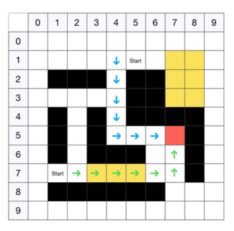

# RL-Labyrint
Training an agent using Reinforcement Learning to crack a labyrinth

## Problem statement

We analyze the SARSA and Q-learning algorithms applied on a 10x10 grid where an agent is moving trying to reach the goal. In particular different parameters are tuned for both algorithms (episode-length,lambda,alpha,epsilon) searching for the best combinations and providing a comparison between SARSA and Q-learning. Finally different obstacles are fed into the environment in order to better analyze the agent behavior.

Walls are placed in the grid which gave a negative reward of -0.1 and they cannot be passed. Sand damage the robot circuits giving him a reward of -0.3, while going outside of the grid results in a negative reward of -0.6.

The agents can take 5 different actions (Up,Down,Left,Right,Stay).

## Paramaters

For the following tests a Grid Search has been implemented in order to find the better configurations of parameters. (alpha discount factor, epsilon, episode length).

## Usage 

In the `training.py`you can enable the best parameters search with the **paramsearch** mode, or you can run in the **agent** mode. 
Moreover you can tune the following parameters 
```bash
episodes --> # number of training episodes
x --> #horizontal size of the box
y --> #vertical size of the box
goal --> #objective point
softmax --> #true use Softmax policy
sarsa --> #true to use Sarsa instead of Q-Learning
discount --> #discount factor applied 
epsilon --> #epsilon greedy policy 
```

Labyrint visual example and the path selected by the trained agent.


